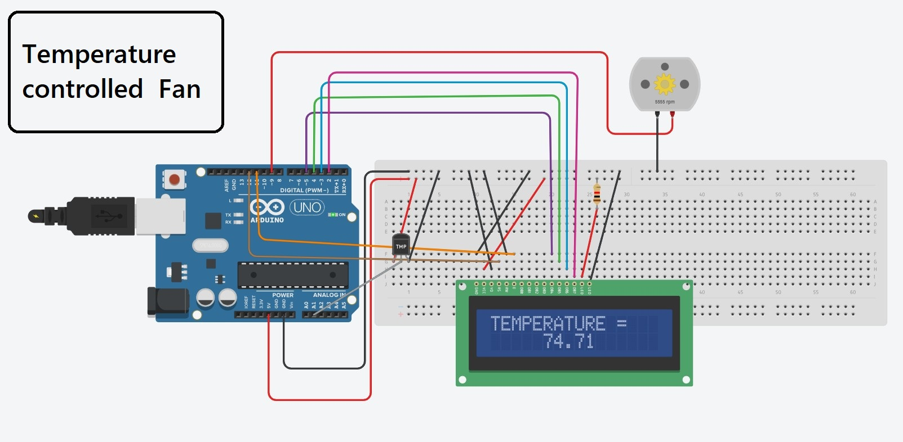

# TEMPERATURE CONTROLLED FAN 

### Materials used

- LCD
- MOTOR(FAN)
- ARDUINO UNO R3
- TEMPERATURE SENSOR

## Image


## simulation video


```cpp
// include library code

#include <LiquidCrystal.h>

LiquidCrystal lcd(12, 11, 5, 4, 3, 2);
float temp;
int tempPin = A1;

#define fan 9

void setup() {
  pinMode (fan ,OUTPUT); //output pin9
  
  // lcd rows and columns
  lcd.begin(16,3);
  
  //printing message on lcd
  lcd.setCursor(3,1);
  lcd.print("Tech Point");
  delay(1000);
  lcd.clear();
  lcd.setCursor(0,1);
  lcd.print("AUTO TEMPERATURE");
  delay(2000);
  lcd.clear();
}


void loop()
{
  lcd.setCursor(3,0);
  lcd.print("Recording");
  lcd.setCursor(2,1);
  lcd.print("Temperature..");
  delay(3000);
  lcd.clear();
  lcd.setCursor(0,2);
  temp = analogRead(tempPin);
  temp = temp * 0.48828124; //converting temperature
  lcd.setCursor(0,0);
  lcd.print("TEMPERATURE = ");
  lcd.setCursor(5,1);
  lcd.print(temp);     // printing temperature
  delay(3000);
  lcd.clear();
  
  	if(temp < 20)
    {
      analogWrite(9,0);
      lcd.print("Fan off");
      delay(2000);
      lcd.clear();
    }
  	else if(temp <= 22)
    {
      analogWrite(fan, 51);
      lcd.print("Fan Speed: 20%");
      delay(2000);
      lcd.clear();
    }
  	else if(temp <= 24)
    {
      analogWrite(fan, 102);
      lcd.print("Fan Speed: 40%");
      delay(2000);
      lcd.clear();
    }
  else if(temp <= 26)
    {
      analogWrite(fan, 153);
      lcd.print("Fan Speed: 60%");
      delay(2000);
      lcd.clear();
    }
  else if(temp <= 22)
    {
      analogWrite(fan, 200);
      lcd.print("Fan Speed: 80%");
      delay(2000);
      lcd.clear();
    }
  else if(temp >= 30)
    {
      analogWrite(fan, 255);
      lcd.print("Fan Speed: 100%");
      delay(2000);
      lcd.clear();
    }
}     
```
